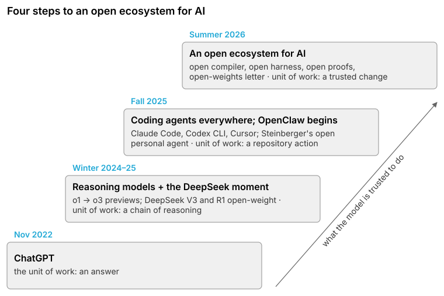
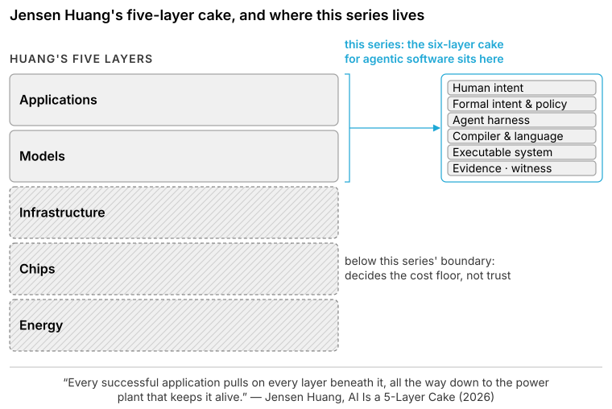
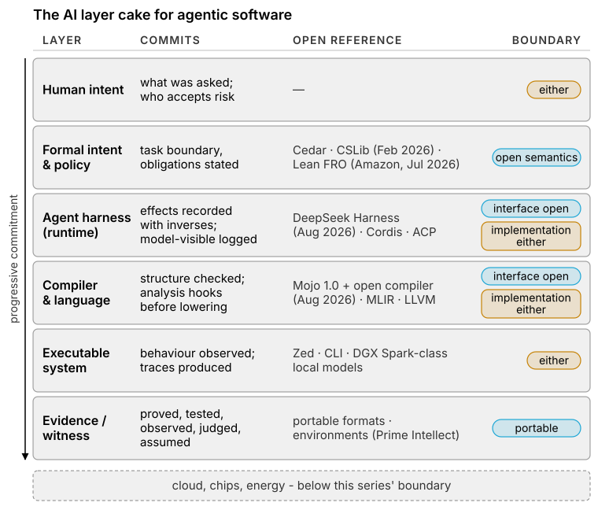
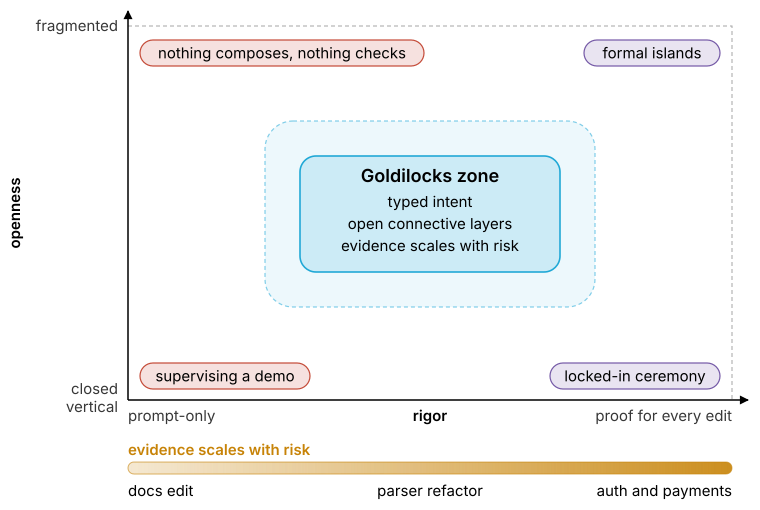
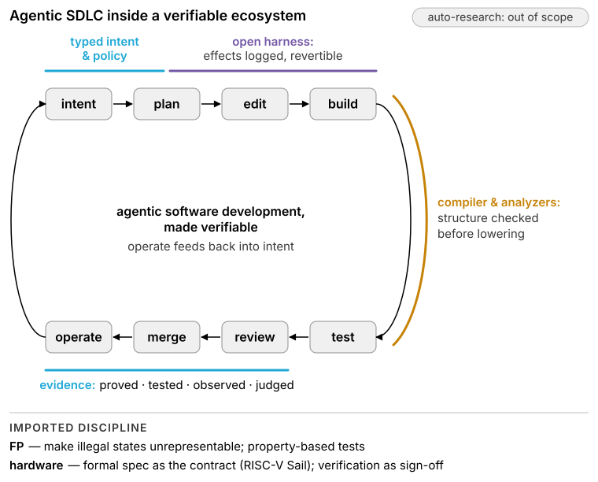
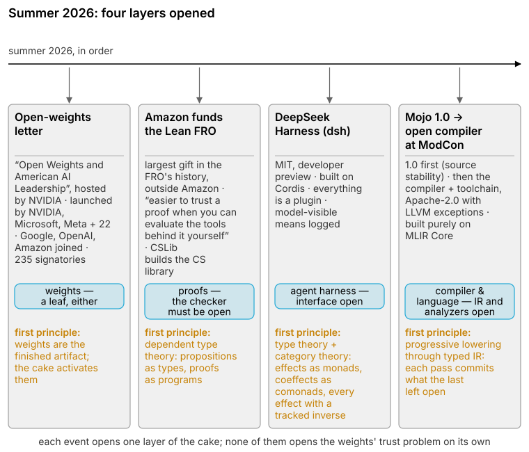

<!-- Dates checked 2026-08-21: "Open Weights and American AI Leadership" coalition letter hosted by NVIDIA 2026-07-24 (PDF revised 2026-07-29, 235 signatories); Amazon / Lean FRO 2026-07-26; Qualcomm closes Modular acquisition 2026-07-29; Mojo 1.0 2026-08-11; DeepSeek Harness created 2026-08-13 (179,486 stars on 2026-08-21); Mojo compiler open-sourced at ModCon 2026-08-18; GLM-5.2 2026-06-16; Kimi K3 full weights 2026-07-27; ICSE 2026 Apr 12–18 (Doctoral Symposium Apr 14, IDE 2026 Apr 18); The Verification Summit 2026-06-10. -->

# Summer 2026: Mojo 1.0, DeepSeek Harness, Lean FRO, and the Open-Weights Letter

*Open and closed systems will coexist. The question is which layers must be open for software written by agents to be trusted.*

**Software is heterogeneous by construction:** it spans languages, type systems, intermediate representations, runtimes, protocols, and deployment targets. AI coding agents do not simplify that landscape; they move across it at machine speed, turning compositional correctness into a systems problem. An AI-native software stack therefore has to return to foundations: type theory for explicit contracts and invariants, category theory for composing tools and effects, and an open ecosystem in which critical interfaces can be inspected, extended, and independently checked.

Four developments in summer 2026 made the emerging architecture concrete. Together, they point to four pillars: open models, typed agent harnesses, open compilers, and independently checkable proof infrastructure.

- an industry coalition published an open letter on open weights;
- DeepSeek shipped an MIT-licensed agent harness;
- Modular open-sourced the Mojo compiler;
- Amazon made the largest gift in the Lean FRO's history.

My stance is neutral on open versus closed and exact about layers. Tan and colleagues argued at ICML 2026, in *If open source is to win, it must go public*, that "open source weights alone are inert" without the layers that activate them, the paper's "activation gap," and conceded that public AI "is not about replacing private labs." Their question is which layers must be public; mine is which must be open for an agent's work to be checked from outside the vendor.

*F0 — What the model is trusted to do, step by step: an answer, a chain of reasoning, a repository action, a trusted change.*

Four steps got us here.

- **November 2022 — ChatGPT.** The unit of work became an answer.
- **Winter 2024–25 — reasoning models and the DeepSeek moment.** o1 and the o3 previews, with DeepSeek's open-weight V3 and R1 landing in the same weeks: the unit of work became a chain of reasoning, and the weights could come from anywhere.
- **Fall 2025 — coding agents everywhere; OpenClaw begins.** Claude Code, Codex CLI, and Cursor, and Peter Steinberger's open personal agent: the unit of work became a repository action.
- **Summer 2026 — an open ecosystem for AI.** An ecosystem opening around the agent, so that the unit of work can be a change someone else can trust.

The cake comes first; the scope of the series follows from it.

## 1. The Open AI Layer Cake

Jensen Huang's cake comes first, because it is the real one. "Industrially, AI is actually essentially a five-layer cake," he wrote in March: energy, chips, infrastructure, models, applications, bottom to top, and "every successful application pulls on every layer beneath it, all the way down to the power plant that keeps it alive." The bottom three layers decide the cost floor. This series lives in the top two, where the code gets written, and it cuts those two into six.

*F8 — Energy, chips, and infrastructure sit below this series' boundary; the six-layer cake for agentic software is a cut through models and applications.*

*F3 — Each layer: what it commits, its 2026 open reference, and its boundary verdict.*

**The cake is the activation gap, drawn for one domain.** Six layers sit above a line: each commits what the layer above left informal, in a form the layer below can check, and each commitment is either open to inspection or sealed inside one vendor.

- **Human intent** commits a goal and a person who accepts the risk. It arrives through whichever client that person types into, open or closed.
- **Formal intent and policy** commits the task boundary: what the agent may touch, what it must preserve, what counts as done. Cedar is the open reference for authority; Lean and CSLib are where obligations land. This layer must be open: a policy semantics only one product understands is configuration, and a proof only one vendor can check is a claim.
- **The agent harness** commits execution: which tool ran, under which capability, with what result, and whether the run can be replayed. Its interface must be open: the protocol the editor speaks to the agent (ACP) and the log of what the model saw. The implementation can be anyone's, and DeepSeek Harness opened this layer in August.
- **Compiler and language** commits meaning: typed structure, an IR that analyzers can attach to, and hooks for checks before lowering erases what they need. The IR and its analyzers must be open; the compiler that produces them can be either. Modular open-sourced Mojo's compiler at ModCon.
- **The executable system** commits behavior: what runs, where, and the traces it throws off. It sits on either side.
- **Evidence and witness** commits the record: what was proved, refuted, tested, observed, judged, assumed, or never checked, in a format a second tool can read. It must be portable. Evidence legible only in one vendor's dashboard is a screenshot.

The weights are what the cake activates, and they sit on either side of the line. Below the cake sit cloud, chips, and energy, outside this series.

> An open flagship lowers the cost floor. It says nothing about whether the agent's software can be trusted.

Goldilocks is a calibration on two axes.

- **Rigor** runs from prompt-only intent with ambient permissions to a proof for every edit; the zone scales evidence to risk.
- **Openness** runs from one vendor owning every layer to a scatter of source that never composes; the zone opens the connective layers while the leaves, the layers nothing else speaks through, go either way.

*F4 — Rigor by openness, with the zone bounded on all four sides.*

## 2. What this series covers

**In scope: coding.**

- The six layers of the cake and the software engineering that runs through them.
- Typed intent and policy.
- Agent harnesses, and the protocols between editor, agent, and tool.
- Compilers, languages, and the IRs that analyzers attach to.
- The executable system and its traces.
- Evidence, and the formats it travels in.
- The agentic software development loop, as the subject being made trustworthy.
- Open models, weights, and RL environments, exactly where they touch those layers: what runs locally, what a reward can verify, what a license allows.

**Out of scope.**

- The ethics of open versus closed. The series takes coexistence as given and argues only about layers.
- Everything below the ABI: chips, cloud, energy, physical hardware, and robotics. They decide the cost floor and nothing about trust.
- Anything outside software engineering.
- Auto-research, the loop that produces papers rather than software.

Three evolving threads.

| Thread | Parts |
|---|---|
| The Goldilocks Zone of the Open Software Ecosystem | 10, tentative and evolving: this essay · from leaky to type-safe abstractions · languages and SDKs for agentic software · compiler infrastructure: MLIR, LLVM, and composable DSLs · agent harnesses, sandboxes, and safe deployment · formal verification and autoformalization · open weights, models, and environments · open protocols and portable evidence · incentives, licensing, and the open social contract · conclusion |
| Hybrid Analysis | 5: static + dynamic analysis · verification + validation · program synthesis + LLMs · mechanistic interpretability + influence functions; fixed models vs. continual learning · a shared analysis and evidence substrate |
| Future of Software Engineering | 5: the agentic development stack: IDEs, CLIs, agent harnesses, and LLMs · high-performance, safe languages for coding agents · protocol proliferation: LSP, ACP, MCP, A2A, and what comes next · engineering personas: software, AI, platform, security, and DevOps · composable tooling across engineering roles |

## 3. AI-assisted software development, made verifiable

*F6 — The agentic SDLC loop with the cake wrapped around it: spec before the first edit, harness around execution, analyzers at build, evidence at merge.*

The loop has not changed, and everything in it moves faster. SWE-agent and OpenHands run it at repository scale, and the literature calls the result the agentic SDLC. A systematic review of 92 studies found the deciding factor: "output verifiability is the primary enabler of agentic adoption."

**A verifiable ecosystem lets agents build verified large-scale software on three principles the functional-programming and hardware communities already live by.**

- **The formal spec is the contract.** RISC-V specifies its architecture twice: the ISA manual is the official prose, and the Sail model is the official formal specification. The Architectural Certification Tests compute expected results from Sail and gate the "RISC-V Compatible" mark. The agentic analogue: intent lands in a spec that tools can execute, and the prose stays prose.
- **Make illegal states unrepresentable.** Yaron Minsky's maxim is typed functional programming's working rule, and the verified canon runs on it: CompCert is written in Coq and extracted to OCaml; seL4's 8,700 lines of C were derived from a Haskell prototype and proved in 200,000 lines of Isabelle; QuickCheck made properties executable tests. An agent that cannot express a forbidden state cannot reach it.
- **Verification is sign-off, not afterthought.** Verification consumes 60 to 70 percent of engineering effort on a chip project; simulation still dominates and formal grows every year. Csmith spent about six CPU-years failing to find a wrong-code bug in CompCert's verified middle-end and still concluded that "verification does not obviate testing, but rather complements it." Proofs and tests travel together, and neither merges on its own word.

> Hardware ships when verification signs off. Software written by agents should ship the same way.

Auto-research is out of scope; this is the loop that ships software.

## 4. Summer 2026, layer by layer

*F7 — The open-weights letter, the Lean FRO gift, DeepSeek Harness, and Mojo's open compiler, each placed on its layer with the first principle it rests on.*

Four weeks, four layers, and each event rests on a first principle older than the product:

- the letter, on the economics of a finished artifact;
- the FRO, on dependent type theory;
- the harness, on type theory and category theory by way of Cordis;
- the compiler, on progressive lowering through typed IR.

Five layers acquired open references this year, on both sides of the must-open line.

### Compiler: Mojo goes open at ModCon

- **Mojo 1.0** shipped on August 11 as a stability milestone: source-stable, 1.x changes "primarily additive," the ABI still unstable.
- **A week later at ModCon**, Modular open-sourced the entire compiler and toolchain under Apache 2.0 with LLVM exceptions.
- **MAX** stays source-available, and Modular is now a Qualcomm company.

Modular's earlier docs called Mojo "the first major language designed expressly for MLIR"; the current vision doc says "built purely on top of MLIR Core," aiming at "a unified language for kernel development." My argument, which Modular does not make: an open, general-purpose compiler built directly on MLIR is the pattern book for MLIR DSLs and for verification hooks that run before lowering. For the language itself, read the Mojo 1.0 post.

Modular's own framing is the systems language for the AI era, and I will add the part it does not say.

- **First on MLIR, first for the AI era.** Mojo is the first major language designed for MLIR and the first mainstream language built for the AI era, with the data plane, training and inference both, as its target.
- **The data plane is split down the middle.** Training lives in PyTorch, a decade old, JAX, and TensorFlow; production inference has moved to purpose-built engines, vLLM, SGLang, TensorRT-LLM, and every model crosses a language boundary on the way from one to the other.
- **MAX**, Modular's graph compiler and serving runtime, sits on the inference side; its Python API and GPU kernels are Apache-2.0, the runtime is source-available.
- **Training in Mojo is arriving from the community.** llm.mojo, Evan Owen's port of Karpathy's llm.c to Mojo 1.0, reports bf16 parity with llm.c on a GB10; Nabla is a JAX-style autodiff framework on Mojo and MAX, Apache-2.0 and alpha.
- **nabla-mojo** is mine, on that line: open source soon, for training coding models only, not a replacement for PyTorch.

**The point is that fifty years of program analysis applies to one platform when training and inference share it, because there is no cross-language seam for the analysis to fall through. Performance is the bonus: a systems language with Rust- and C++-class speed and zero-cost abstractions comes with the platform.**

Modular is not taking compiler contributions yet, "particularly in today's era of AI coding," and aims to by year end: open in source, closed in governance. No analyzer needs that queue; the IR is must-open, the gate is can-close.

### Harness: DeepSeek Harness on Cordis

DeepSeek Harness, binary `dsh`, arrived on August 13 as an MIT-licensed developer preview and had 179,486 GitHub stars by August 21. It is built on Cordis, a 2022 plugin framework it credits as its foundation, with two invariants:

- **Everything is a plugin**, the agent loop included, with no privileged core.
- **Model-visible means logged**: anything that reaches a model request must be reconstructable from the append-only session log.

pi, Mario Zechner's coding agent, is the opposite answer to the same problem:

- pi keeps a four-tool core and refuses sub-agents, plan mode, and MCP;
- `dsh` ships sub-agents, planning, skills, sandboxing, and approval policy;
- only `dsh`'s Minimal preset, a two-tool loop for benchmarking, is pi-shaped, and pi's only footprint in `dsh` is one npm package behind one model-adapter plugin.

This is the layer Tan and colleagues say stays private, the harness that "captures the user's exact process of software development." The log and the plugin interface are must-open, the harness can be anyone's, and a model lab has opened it.

### Proofs: Amazon funds Lean outside Amazon; CSLib builds the library

On July 26 Amazon's Automated Reasoning organization made what the Lean FRO calls the single largest donation in its history, amount undisclosed, to a body outside Amazon. Its reason is the argument for open proof tools: "it's easier to trust a proof when you can evaluate the tools behind it yourself."

CSLib is separate:

- announced in August 2025 with a white paper this February: Mathlib for computer science plus Boole, a Boogie-style intermediate language that discharges into Lean verification conditions;
- steered by Amazon, Google DeepMind, Stanford, UT Austin, Southern Denmark, and the Lean FRO, and funded through a Renaissance Philanthropy program;
- explicit about the constraint, "AI-based provers are bottlenecked by the abstractions available in the underlying proof assistant," and right about governance: AI advisory only, every commit through manual review.

My judgment: an independently governed checker plus a shared library of abstractions is the biggest step AI-aided formal verification has taken toward agents writing proofs that humans can check. The checker is where trust bottoms out, so its governance is must-open.

### Weights: the coalition letter

On July 24 NVIDIA hosted "Open Weights and American AI Leadership," an open letter to U.S. policymakers.

- It grew from 25 launch signatories led by NVIDIA, Microsoft, and Meta to 235 in its July 29 revision; Google, OpenAI, and Amazon joined within the week, and most signatories are startups, infrastructure vendors, and nonprofits.
- It is advocacy, not commitment, on five arguments: access, competition, control, adaptability, and security.
- The last is inverted from the usual framing: "Relying solely on closed models is not inherently safe."

The letter argues for the artifact; Tan and colleagues call it inert. Both are right: weights set the cost floor, a leaf either way, and the cake decides whether the output can be trusted.

### Models and environments: Prime Intellect, GLM, Kimi, and a desk-sized box

Prime Intellect's stack separates the trainer from the task.

- **prime-rl** (Apache-2.0) runs the asynchronous RL loop.
- **verifiers** (MIT) packages a task as an environment: a dataset plus a harness plus reward functions.
- **The Environments Hub** versions more than 2,500 of them.
- The reward is a deterministic check or an LLM judge "where deterministic evaluation is impractical." The mapping is mine, not Prime Intellect's: a deterministic reward is verification, a judged reward is validation, and one environment scores training and evaluation alike.

The open models and the desk-sized box:

- Z.ai's GLM-5.2 (753B parameters, MIT) and Moonshot's Kimi K3 (2.8T, Kimi K3 License) approach frontier models on the labs' own benchmarks; Moonshot itself says K3 "still trails the most powerful proprietary models."
- Neither runs on a DGX Spark. NVIDIA rates the $4,699, 128 GB box for inference to 200B parameters and fine-tuning to 70B.
- What fits is GLM-4.7-Flash (30B-A3B, MIT) and its 30-to-70B peers. NVIDIA documents LoRA fine-tuning on the box; running prime-rl's RL loop there is undocumented.

Models are leaves. Environments are evidence, and a reward nobody else can run is not a benchmark, so environments must be open.

## 5. Why open? Three incentives, one boundary

The five stories share a mechanism, and it is not that open source is good. Private actors open a layer for one of three reasons, and the reasons are not exclusive.

- **Common infrastructure.** "This should be something everyone can build on." Internet standards, Linux, LLVM: a foundational layer becomes more valuable as shared ground than as a private island.
- **Strategic collaboration.** "We benefit more by sharing this layer than by competing over it." Shared cost, catching up to an incumbent, commoditizing a non-core layer, competing somewhere else. A company opens the layer where ecosystem growth beats exclusivity and captures value next to it.
- **Network effects.** "The technology becomes more valuable when everyone can participate." Programming languages, compilers and IRs, protocols, package ecosystems, agent interfaces, policy languages: each is worth more with every implementation that speaks it, and closing one destroys the externality that made it valuable.

LLVM is all three at once, which is why Chris Lattner's *Democratizing AI Compute* series is the closest precedent for this one:

- as **common infrastructure**, a permissively licensed compiler substrate;
- as **collaboration**, Apple, Google, NVIDIA, AMD, and Intel sharing an enormous body of compiler engineering rather than rebuilding it five times;
- as a **network**, worth more with every language, target, and tool that plugs in.

> Open ecosystems emerge when private actors find more value in sharing a foundational layer than in owning it.

Sometimes that begins as a public good, sometimes as strategic necessity, sometimes because the technology cannot reach its value without a network; usually all three end up reinforcing one another. That sentence recurs through the ten parts, and it sharpens the question the series is really asking: **which layers of the AI software stack become common infrastructure, which stay competitive, and what economic or technical force draws the line?** It leaves room to read Linux, LLVM and MLIR, Mojo, Rust, Cedar, ACP and MCP, agent harnesses, models, and inference runtimes each on its own terms, without assuming they are open for the same reason.

Where Tan and colleagues answer with institutions, I answer with a rule.

- **A layer that exists to connect independent systems must be open:** policy semantics, agent protocols, effect logs, compiler IR and its analyzers, evidence formats, the proof checker.
- **A leaf can be closed**, as long as the layers around it emit portable evidence: weights, hosted inference, the best client, a compiler's contribution queue.

The reader's test: does a layer's value come from connecting things that do not share an owner? Zed, a GPL-3.0 editor speaking an Apache-2.0 protocol to closed agents behind it, passes; a harness whose session log only its vendor can parse does not.

## 6. The ecosystem is its tooling

**An ecosystem is as good as its developer tooling.** Weights without a harness are a download; proofs without an open checker are a vendor's assurance. Trust arrives through the compiler that checks, the harness that logs, the prover that admits, and the evidence format that survives a vendor change.

The AI engineer's toolbox already shows the boundary, plane by plane:

| Plane | Open | Closed, hosted |
|---|---|---|
| Training | PyTorch (2016, BSD-3, PyTorch Foundation) · JAX (Apache-2.0) | — |
| RL post-training | prime-rl · verl (ByteDance) · TRL (Hugging Face) · OpenRLHF | Fireworks reinforcement fine-tuning |
| Inference | vLLM · SGLang (LMSYS) | Fireworks · every frontier API |
| Orchestration and agents | LangChain / LangGraph · OpenAI Agents SDK · DeepSeek Harness | Claude Code · Cursor |

The open column is where the connective layers are; the closed column is leaves. A team can run the whole loop on the open column today, and the closed column competes on being better, not on being the only way in.

The series goes deep on each layer from here; the holy wars of programming languages and their SDKs, and where each language sits in the cake, come in Part 3. Next: Part 2, From Leaky Abstractions to Type-Safe Abstractions in the Era of the Open Ecosystem.

This essay is the culmination of conversations with hundreds of researchers across three 2026 events:

- ICSE 2026 in Rio de Janeiro, from the Doctoral Symposium (April 14) to the IDE 2026 workshop organized by JetBrains Research (April 18);
- The Verification Summit by Pramaana Labs, San Francisco (June 10);
- ModCon 2026, San Francisco (August 18).

## References

### Stance

1. J. Tan, N. Vincent, K. Elkins, M. Sahlgren, J. Low, D. Pham, S. Pyysalo, J. Jitsev, "Position: If open source is to win, it must go public," ICML 2026 (Spotlight), arXiv:2507.09296v3: https://arxiv.org/abs/2507.09296

### Agentic SDLC and verified-software principles

2. H. Bhati, "Agentic AI in the Software Development Lifecycle," arXiv:2604.26275 (2026-04-29): https://arxiv.org/abs/2604.26275
3. J. Yang et al., "SWE-agent: Agent-Computer Interfaces Enable Automated Software Engineering," NeurIPS 2024, arXiv:2405.15793: https://arxiv.org/abs/2405.15793
4. X. Wang et al., "OpenHands: An Open Platform for AI Software Developers as Generalist Agents," ICLR 2025, arXiv:2407.16741: https://arxiv.org/abs/2407.16741
5. S. A. Apostolou, J. Bosch, H. Holmström Olsson, "Assistance to Autonomy: A Systematic Literature Review of Agentic AI across the Software Development Life Cycle," arXiv:2605.15245 (2026-05-14): https://arxiv.org/abs/2605.15245
6. riscv/sail-riscv, formal specification of the RISC-V ISA: https://github.com/riscv/sail-riscv
7. RISC-V ISA Formal Spec Public Review (2019; Sail selected over Forvis, GRIFT, riscv-plv, Kami): https://github.com/riscvarchive/ISA_Formal_Spec_Public_Review
8. riscv/riscv-arch-test, Architectural Certification Tests (Sail as reference model; "not verification tests"): https://github.com/riscv/riscv-arch-test
9. H. Foster, 2024 Siemens EDA / Wilson Research Group IC/ASIC Functional Verification Trend Report: https://verificationacademy.com/topics/planning-measurement-and-analysis/wrg-industry-data-and-trends/2024-siemens-eda-and-wilson-research-group-ic-asic-functional-verification-trend-report/
10. X. Leroy, "Formal verification of a realistic compiler," CACM 52(7), 2009: https://xavierleroy.org/publi/compcert-CACM.pdf
11. X. Yang, Y. Chen, E. Eide, J. Regehr, "Finding and Understanding Bugs in C Compilers," PLDI 2011: https://users.cs.utah.edu/~regehr/papers/pldi11-preprint.pdf
12. G. Klein et al., "seL4: Formal Verification of an OS Kernel," SOSP 2009: https://dl.acm.org/doi/10.1145/1629575.1629596
13. Y. Minsky, "Effective ML Revisited," Jane Street (2011-03-09): https://blog.janestreet.com/effective-ml-revisited/
14. K. Claessen, J. Hughes, "QuickCheck: A Lightweight Tool for Random Testing of Haskell Programs," ICFP 2000: https://www.cs.tufts.edu/~nr/cs257/archive/john-hughes/quick.pdf

### Compiler

15. Modular, "Modular 26.5: Mojo 1.0 is here!" (2026-08-11): https://www.modular.com/blog/modular-26-5-mojo-1-0-is-here
16. Mojo documentation, "Mojo stability guarantees" (source-level; ABI not stable): https://mojolang.org/docs/api-docs/stability/
17. Modular, "Mojo is now open source!" (2026-08-18; Apache 2.0 with LLVM exceptions; compiler contributions not yet accepted): https://www.modular.com/blog/mojo-open-source
18. Modular, "ModCon 2026: Open source, open cloud, open silicon" (2026-08-18): https://www.modular.com/blog/modcon-announcements
19. Qualcomm / Modular, "Qualcomm Completes Acquisition of Modular" (2026-07-29): https://www.modular.com/blog/qualcomm-completes-acquisition-of-modular
20. Modular, "Why Mojo" (archived 2024-06-05; "the first major language designed expressly for MLIR"; page since redirected): https://web.archive.org/web/20240605012702/https://docs.modular.com/mojo/why-mojo
21. Mojo documentation, "Mojo vision" ("built purely on top of MLIR Core"; "a unified language for kernel development"): https://mojolang.org/docs/vision/

### Harness

22. DeepSeek AI, DeepSeek Harness (MIT, developer preview; repo created 2026-08-13; 179,486 stars on 2026-08-21): https://github.com/deepseek-ai/deepseek-harness
23. DeepSeek AI, "DeepSeek Harness Architecture" (everything is a plugin; model-visible means logged): https://github.com/deepseek-ai/deepseek-harness/blob/master/docs/architecture.md
24. DeepSeek AI, DeepSeek Harness product site (Standard, Code, Minimal, Creator modes): https://deepseek.com/harness/en/
25. cordiverse/cordis, meta-framework of spatiotemporal composability (MIT, 2022): https://github.com/cordiverse/cordis
26. Y. Shi, W. Zhang, T. Cui, "A Programming Paradigm for Spatiotemporal Composability" (Cordis paper): https://github.com/cordiverse/paper
27. M. Zechner et al., pi coding agent, philosophy (four tools; no sub-agents, plan mode, or MCP): https://github.com/earendil-works/pi/blob/main/packages/coding-agent/README.md
28. Agent Client Protocol (Apache-2.0): https://agentclientprotocol.com
29. Zed (GPL-3.0-or-later): https://github.com/zed-industries/zed

### Proofs and policy

30. B. Cook, S. Bice, "Amazon is investing in the Lean Focused Research Organization," Amazon Science (2026-07-26): https://www.amazon.science/news/amazon-is-investing-in-the-lean-focused-research-organization
31. Lean FRO, "About the Lean FRO" (timeline; Amazon Automated Reasoning donation): https://lean-lang.org/fro/about/
32. C. Barrett, S. Chaudhuri, F. Montesi, J. Grundy, P. Kohli, L. de Moura, A. Rademaker, S. Yingchareonthawornchai, "CSLib: The Lean Computer Science Library," arXiv:2602.04846 (2026-02-04): https://arxiv.org/abs/2602.04846
33. CSLib Initiative (Renaissance Philanthropy), "About": https://www.cslib.io/initiative/about
34. cedar-spec, Lean formalization and differential testing of Cedar: https://github.com/cedar-policy/cedar-spec

### Weights

35. NVIDIA et al., "Open Weights and American AI Leadership," open letter (2026-07-24; PDF revised 2026-07-29, 235 signatories): https://images.nvidia.com/pdf/Open-Weights-and-American-AI-Leadership.pdf
36. Microsoft, live signatory page (270+ organizations as of 2026-08-03): https://www.microsoft.com/en-us/corporate-responsibility/topics/open-weight/
37. Security Boulevard, "Nvidia Rallied the Industry Behind Open Weights. Then OpenAI Joined Anyway." (August 2026): https://securityboulevard.com/2026/08/nvidia-rallied-the-industry-behind-open-weights-then-openai-joined-anyway/

### Models and environments

38. Prime Intellect, prime-rl (Apache-2.0; vLLM inference, orchestrator, FSDP2 trainer): https://github.com/PrimeIntellect-ai/prime-rl
39. Prime Intellect / W. Brown, verifiers (MIT; environments, rubrics, LLM judges): https://github.com/PrimeIntellect-ai/verifiers
40. Prime Intellect, "Environments Hub" (2025-08-27): https://www.primeintellect.ai/blog/environments
41. Z.ai, GLM-5.2 model card (753B, MIT, 2026-06-16): https://huggingface.co/zai-org/GLM-5.2
42. Z.ai, GLM-4.7-Flash model card (30B-A3B, MIT): https://huggingface.co/zai-org/GLM-4.7-Flash
43. Moonshot AI, "Kimi K3: Open Frontier Intelligence" ("still trails the most powerful proprietary models"): https://www.kimi.com/blog/kimi-k3
44. Moonshot AI, Kimi K3 model card and license (2.8T, Kimi K3 License): https://huggingface.co/moonshotai/Kimi-K3
45. NVIDIA, DGX Spark product page (128 GB unified memory; 200B inference; 70B fine-tuning): https://www.nvidia.com/en-us/products/workstations/dgx-spark/
46. NVIDIA Developer Forums, DGX Spark price change to $4,699 (2026-02-23): https://forums.developer.nvidia.com/t/2-23-2026-price-change-announcement/361713
47. NVIDIA, DGX Spark "Fine-tune with PyTorch" playbook (1–70B; SFT, LoRA, QLoRA): https://build.nvidia.com/spark/pytorch-fine-tune

### Conferences

48. ICSE 2026, Rio de Janeiro (April 12–18): https://conf.researchr.org/home/icse-2026
49. ICSE 2026 Doctoral Symposium (April 14): https://conf.researchr.org/track/icse-2026/icse-2026-doctoral-symposium
50. IDE 2026, 3rd International Workshop on Integrated Development Environments, co-located with ICSE 2026 (April 18; general chair Y. Golubev, JetBrains Research): https://ide-workshop.github.io/
51. The Verification Summit, Launch Edition, Pramaana Labs, San Francisco (2026-06-10): https://verificationsummit.ai/
52. ModCon 2026: Compute Unlocked, Grand Hyatt San Francisco (2026-08-18): https://www.modular.com/modcon

### AI evolution

53. OpenAI, "Introducing ChatGPT" (2022-11-30): https://openai.com/index/chatgpt/
54. OpenAI, "Introducing OpenAI o1-preview" (2024-09-12): https://openai.com/index/introducing-openai-o1-preview/
55. DeepSeek, DeepSeek-R1 (MIT, 2025-01-20): https://github.com/deepseek-ai/DeepSeek-R1
56. Anthropic, "Claude Code is now generally available" (2025-05-22): https://www.anthropic.com/news/claude-4
57. OpenAI, Codex CLI (Apache-2.0, 2025-04-16): https://github.com/openai/codex
58. OpenClaw, Peter Steinberger's open-source personal agent (MIT; begun Nov 2025 as Clawdbot, renamed 2026-01-30): https://github.com/openclaw/openclaw

### The five-layer cake

59. J. Huang, "AI Is a 5-Layer Cake," NVIDIA Blog (2026-03-10): https://blogs.nvidia.com/blog/ai-5-layer-cake/

### Mojo, MAX, and training in Mojo

60. Modular, MAX framework (graph compiler and serving runtime; Modular Community License; Python API and kernels Apache-2.0): https://docs.modular.com/max/
61. E. Owen, llm.mojo — Karpathy's llm.c ported to Mojo 1.0 (MIT): https://github.com/ulmentflam/llm.mojo
62. T. Fehrenbach, Nabla — JAX-style autodiff on Mojo and MAX (Apache-2.0, alpha): https://github.com/nabla-ml/nabla
63. vLLM (Apache-2.0; PyTorch Foundation project): https://github.com/vllm-project/vllm
64. SGLang (Apache-2.0; LMSYS): https://github.com/sgl-project/sglang
65. NVIDIA, TensorRT-LLM: https://github.com/NVIDIA/TensorRT-LLM

### The AI engineer's toolbox

66. PyTorch (BSD-3-Clause; PyTorch Foundation): https://pytorch.org
67. JAX (Apache-2.0): https://github.com/jax-ml/jax
68. verl (ByteDance Seed; Apache-2.0): https://github.com/verl-project/verl
69. TRL (Hugging Face; Apache-2.0): https://github.com/huggingface/trl
70. OpenRLHF (Apache-2.0): https://github.com/OpenRLHF/OpenRLHF
71. Fireworks AI, reinforcement fine-tuning (hosted): https://fireworks.ai/reinforcement-fine-tuning
72. LangGraph (MIT): https://github.com/langchain-ai/langgraph
73. OpenAI Agents SDK (MIT): https://github.com/openai/openai-agents-python

### Why open

74. C. Lattner, "DeepSeek's Impact on AI (Democratizing AI Compute, Part 1)," Modular (2025-01): https://www.modular.com/blog/democratizing-compute-part-1-deepseeks-impact-on-ai
75. LLVM Project, Developer Policy — permissive, non-copyleft licensing "fosters the widest adoption of LLVM": https://llvm.org/docs/DeveloperPolicy.html
